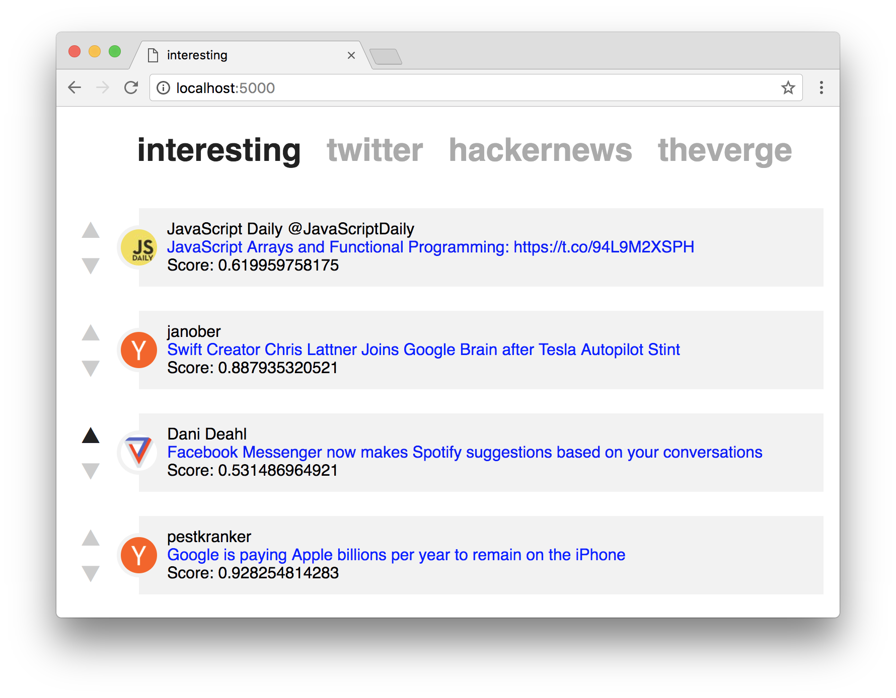

Interesting
===========

Collect tech news articles and tweets in one place and filter out the interesting content by tagging items as either interesting or boring (vote up/down).

Installation
------------

Ensure you have Python 3 installed. The application is tested with Python 3.6.1 on macOS Sierra.

If you are on macOS and use homebrew:

    brew install python3

Create virual environment and activate it:

    python3 -m venv .env
    source .env/bin/activate

Install dependencies:

    python -m pip install -r requirements.txt

Configuration
-------------

You can activate different data sources in `config.yml`. If you want to activate Twitter you need to create a Twitter application with your own account on https://dev.twitter.com. Copy the required keys and secrets into the config.

The application will automatically collect data from all the sources that are configured in the config under source.

Running the application
-----------------------

Execute `run.sh` (or see its content how to do it manually).

Point your browser to http://localhost:5000.

Content of the enabled sources will appear in the corresponding sections. By up- and downvoting items the systems learns the user's interests. For items to appear in the _interesting_ section for a particular data source one needs to have at least one upvote and one downvote. The more data is gathered the more accurate the prediction becomes (200+ tagged items for a data source is a good start).

Classifier evaluation
---------------------

There is an extensible list of classifier pipelines defined in `classifier.py` that is used for evaluation. Run `python eval.py` to get cross validation metrics for each pipeline (precision, recall, etc.).